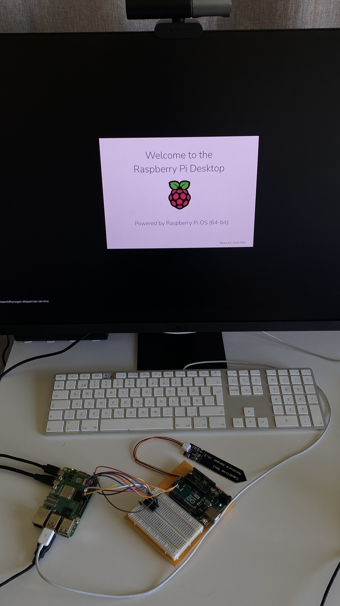
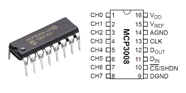

# Microprocessors & Signals

An introduction to microprocessor systems, signal theory, and embedded programming.

## Learning Goals
- Understand analog and digital signals, sampling, and quantization
- Know common sensors and electrical actuators
- Understand the architecture and function of microprocessors and microcontrollers
- Program and build real microprocessor applications

## Tools Used
### Arduino - Reading sensors, PWM signals, real-time control
### Raspberry - PiLogging data, running Python, displaying output
### Logisim - Designing and simulating digital circuits before building

## Course Content
- Analog & digital signals — sampling, aliasing, quantization
- Microprocessors — architecture, connectivity, and environment interaction
- Sensors & actuators — measuring and affecting the physical world
- Programming microprocessors using suitable languages
- Operating systems for microprocessors
- Development project around a chosen microprocessor application

## Prerequisites
- Basic programming 
- Basic mathematics 

## Hardware

### Raspberry Pi 5

40-pin GPIO header running at 3.3V logic. Key communication pins: **I2C** on GPIO2 (SDA) and GPIO3 (SCL) for connecting multiple sensors on 2 wires; **UART** on GPIO14 (TX) and GPIO15 (RX) for serial communication with devices like Arduino; **SPI** on GPIO10 (MOSI), GPIO9 (MISO), GPIO11 (SCLK), GPIO8 (CE0) for high-speed peripherals; **PWM** on GPIO12, GPIO13, GPIO18, GPIO19 for motor and LED control.

---

### MCP3008

10-bit ADC chip that gives the Raspberry Pi analog input capability via **SPI**. Provides 8 analog channels (CH0–CH7), converting voltages to digital values from 0–1023. Connects CLK→GPIO11, DOUT→GPIO9, DIN→GPIO10, CS→GPIO8, with VDD and VREF tied to 3.3V.

---

### Arduino Uno

ATmega328P-based board running at 16 MHz with 14 digital pins, 6 analog inputs (10-bit ADC), and PWM on pins marked ~ (D3, D5, D6, D9, D10, D11). Communication: **I2C** on A4 (SDA) / A5 (SCL); **SPI** on D10 (SS), D11 (MOSI), D12 (MISO), D13 (SCK); **UART** on D0 (RX) / D1 (TX).

---

## What I built
- [arduino-sensor-monitor/](arduino-sound-sensor-monitor/) — Sound Data Logger
- [Soil-Moisture‐Based-Plant-Watering-Reminder/](https://github.com/zinebnadak/Microprocessors-and-signals_pd3/tree/main/Soil-Moisture%E2%80%90Based-Plant-Watering-Reminder) - Soil Moisture‐Based Plant Watering Reminder

