# Soil Moisture-Based Plant Watering Reminder
**Microprocessors & Signals Project** &nbsp;·&nbsp; Raspberry Pi 5 · Capacitive Soil Moisture Sensor · MCP3008 ADC · Logisim

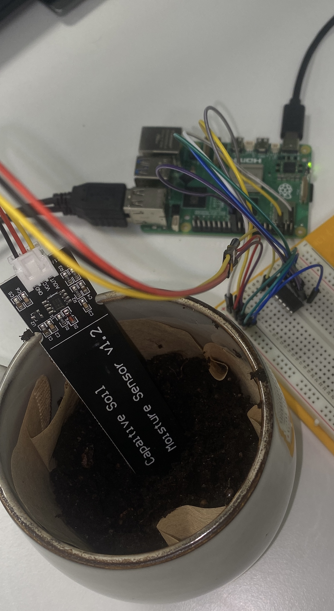

---

## What It Does

A capacitive soil moisture sensor measures the water content in soil as an analog voltage. The MCP3008 ADC chip converts that analog signal into a digital value (0–1023) and sends it to the Raspberry Pi via SPI. The Pi logs every reading to a CSV file, plots them as a live graph, and sends a real-time notification to your phone when the plant needs watering.

---

## Course Coverage

| Learning Goal | How It's Addressed |
|---|---|
| Analog & digital signals, sampling, quantization | Sensor outputs analog voltage → MCP3008 samples at fixed intervals → ADC quantizes to 0–1023 |
| Sensors | Capacitive soil moisture sensor as input |
| Microprocessor architecture & programming | Raspberry Pi 5 (ARM) runs Python; MCP3008 handles ADC conversion |
| Operating systems for microprocessors | Raspberry Pi runs Raspberry Pi OS — Linux on microprocessor-class hardware |
| Digital circuit design | ADC circuit designed and simulated in Logisim before wiring |
| Development project | Full working system from sensor to live display and mobile alert, end to end |

---

## Hardware

- Raspberry Pi 5 (4GB)
- Capacitive Soil Moisture Sensor v1.2 (analog output)
- MCP3008 ADC chip — converts analog sensor signal to digital for the Pi
- Breadboard, jumper wires (M-M, M-F), USB-C power supply
- MicroSD card (32GB) with Raspberry Pi OS

---

## Software

- **Logisim Evolution** — simulates ADC circuit
- **Python 3 on Raspberry Pi** — `pip install spidev gpiozero matplotlib requests`
- **Raspberry Pi OS** — Linux-based OS running on the Pi

---

## Build Status

| Part | Task | Tool | Status |
|---|---|---|---|
| 1 | Simulate ADC circuit | Logisim | ✓ |
| 2 | Wirings | Raspberry Pi | ✓ |
| 3 | Read SPI data from MCP3008 in Python | Raspberry Pi | ✓ |
| 4 | Log data to CSV | Pi + Python | ✓ |
| 5 | Live graph with matplotlib | Pi + Python | ✓ |
| 6 | Send phone notification when dry | Pi + Python | ✓ |
| 7 | Polish, test end to end | All | ✓ |

---

## How to Build:

## part 1: Simulate ADC circuit
> The ADC circuit was simulated in Logisim Evolution using a 10-bit Register to model the MCP3008's conversion. ANALOG_IN receives the sensor value, the Register stores it on each clock tick when CHIP_SELECT pin is high (1), and DIGITAL_OUT outputs the digital value. Testing with dry soil , moist and wet binary values confirmed the signal passes correctly through the circuit. 

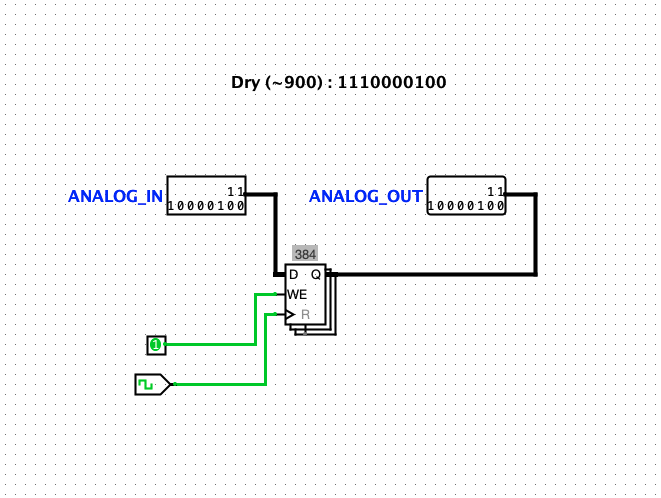
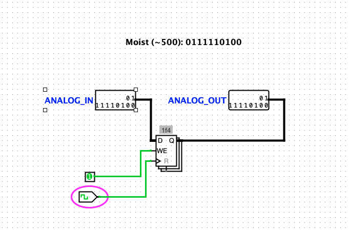
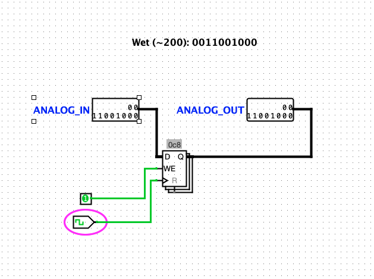

## part 2: Wirings

> Place the MCP3008 so it straddles the center gap of the breadboard. The notch part of the MCP3008 should be up (facing away form you), so that pin 1-8 and its legs are on the left and pin 9-16 with its legs are on the right side.

### MCP3008 to Raspberry Pi (SPI):
Pin 16 (VDD) to PI 1. Pin 15 (VREF) to PI 17. Pin 14 to PI 9 (GND). Pin 13 to PI 23 (CLK). Pin 12 to PI 21. Pin 11 to PI 19. Pin 10 to PI 24. Pin 9 to PI 25 (GND) Pin 1 (CH0) receives the analog signal from the soil moisture sensor. Pins 2–8 (CH1–CH7) are left unconnected.


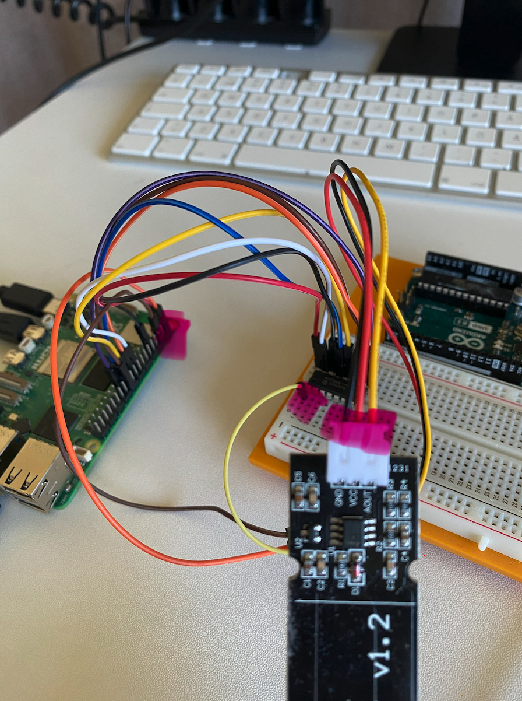
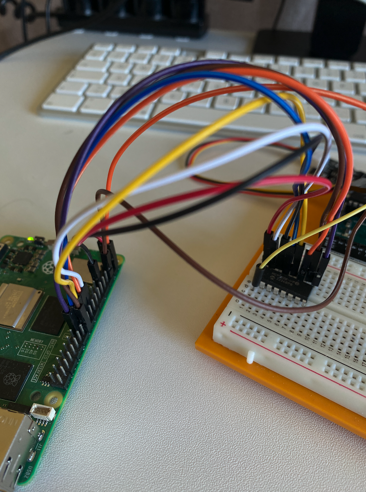


### Soil moisture sensor
The sensor v1.2 connects via its JST connector. Black wire → PI ground (-). Red wire → PI 5V (+). Yellow wire (AOUT) → MCP3008 Pin 1 (CH0)


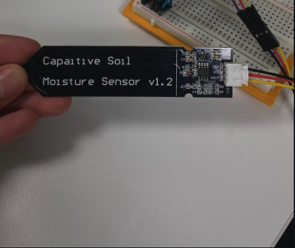


### Final wirings!

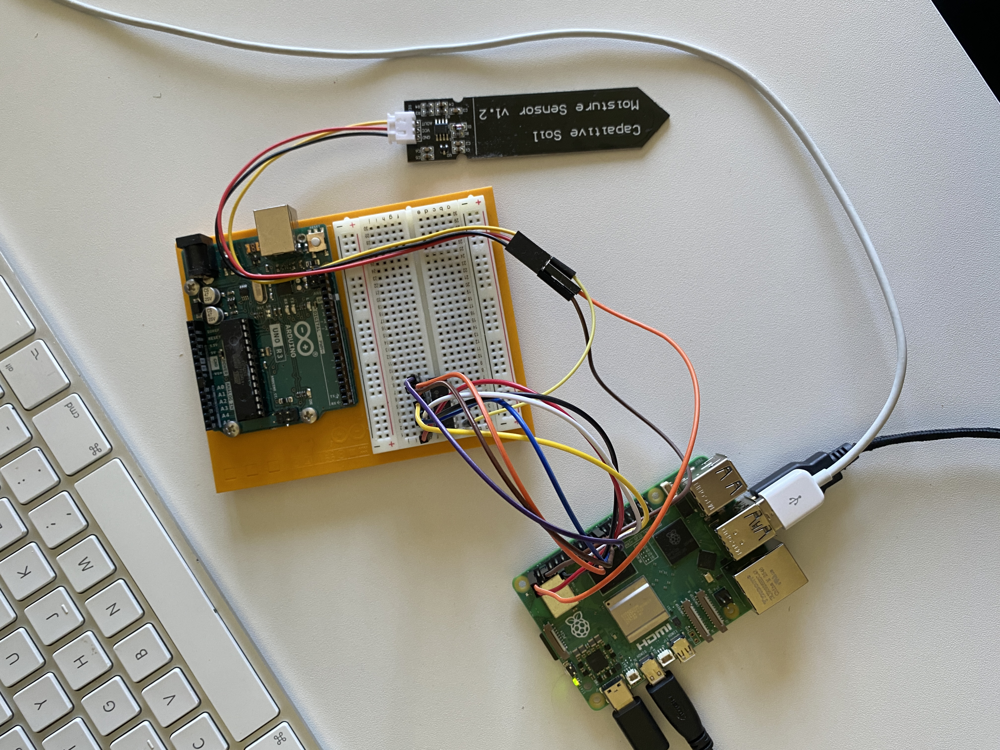


## part 3: Read SPI data from MCP3008 in Python
The starting point. Opens the SPI connection to the MCP3008 and reads the raw ADC value from channel 0 every 2 seconds. Prints a timestamp and the raw number (0–1023) to the terminal.  No conversion or no logging yet, just confirming the sensor and wiring work.

> First equip the PI with keyboard, mouse, power and monitor, till you see the GUI.
> Next confirm SPI is enabeled! 
- For the Raspberry PI Software Configuration Tool go to Menu → Accessories → Terminaland type ```sudo raspi-config```
- Use arrow keys to select 3 Interface Options → press Enter
- Select SPI → press Enter
- Select Yes to enable → press Enter to confirm
- Press Finish to exit

> In terminal install the required libraries
``` pip install spidev gpiozero matplotlib requests --break-system-packages```

> Create a new file!
```readsensor.py```

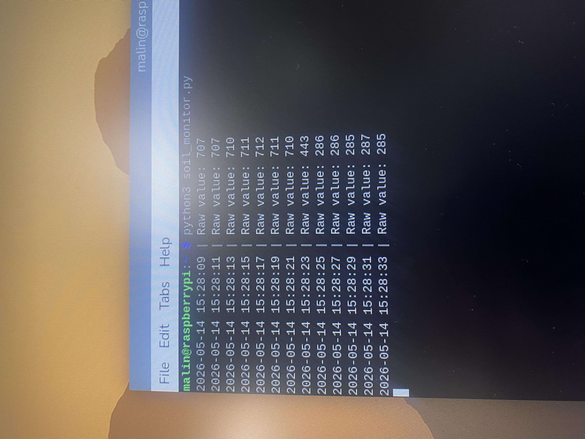


## part 4: Log data to CSV
Adds CSV logging on top of the sensor read. Every reading gets converted to a moisture percentage using the dry/wet calibration values, then written as a row in moisture_log.csv with a timestamp, raw ADC value, and percentage. Useful for tracking moisture over time.
> Create a new file!
```logger.py```

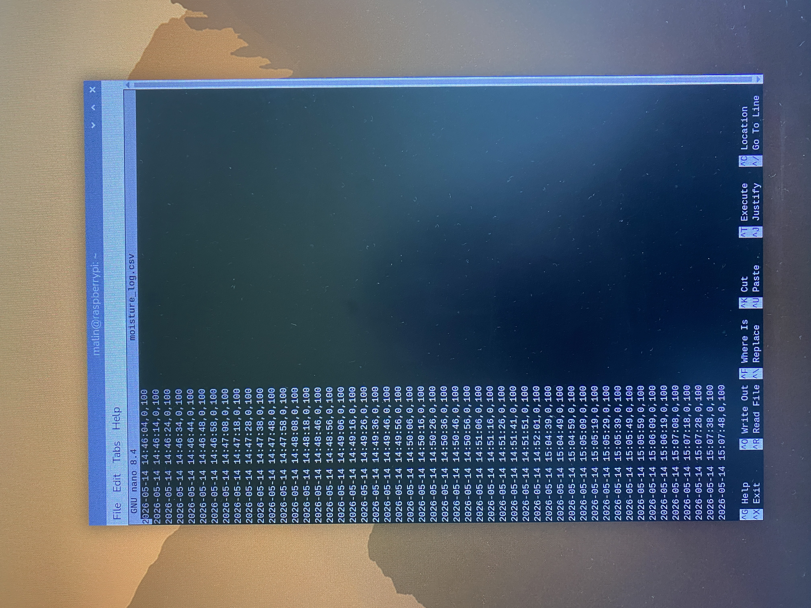

## part 5: Live graph with matplotlib
Adds a live matplotlib graph. Instead of just printing to the terminal, it plots moisture percentage over time in a window that updates every second. The x-axis shows timestamps and the y-axis shows 0–100%. Good for visually watching the soil dry out.
> Create a new file!
```live_graph.py```

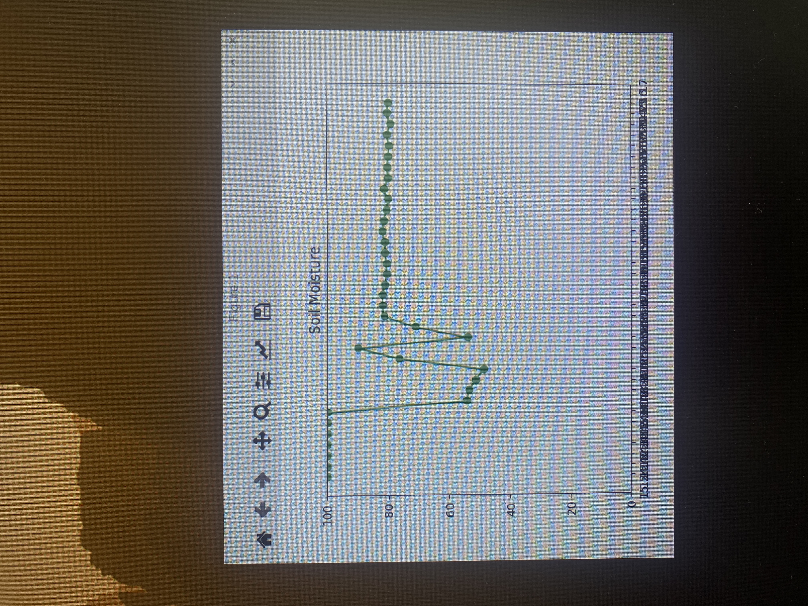

## part 6: Send phone notification when dry
> Create a new file!
```notifier.py```

Adds Telegram alerts. Reads the sensor, converts to percentage, and if the moisture drops below the threshold it sends a message to your phone via the Telegram Bot API. No graph, no CSV , its just the alert logic on top of the sensor read.
This project uses the Telegram Bot API token and your personal telegram chat-id to send moisture alerts to your phone:
- Open Telegram and message [@BotFather](https://t.me/botfather)
- Send /newbot, follow the prompts, and copy your bot token
- Send any message to your new bot, then visit: https://api.telegram.org/bot<YOUR_TOKEN>/getUpdates
- Look for the "id" field inside "chat" ,that's your chat ID
- Paste both into soil_monitor.py:
``` TELEGRAM_TOKEN   = "your token here"```
```TELEGRAM_CHAT_ID = "your chat ID here"```

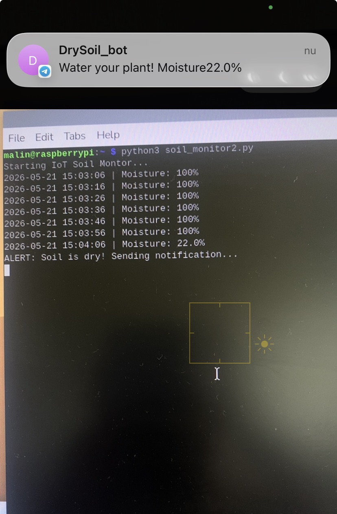
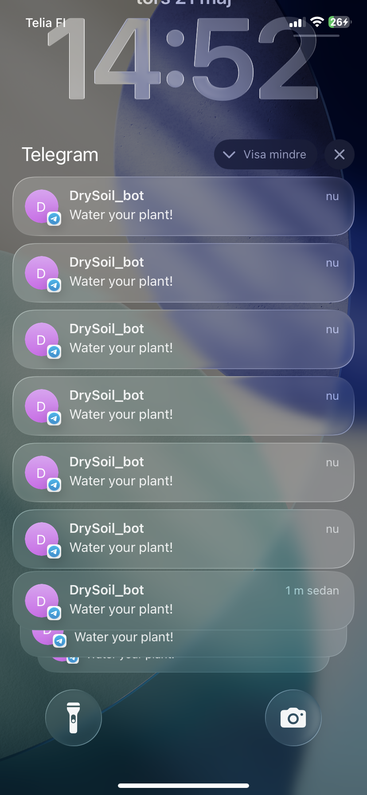

## part 7: Polish, test end to end
> Rather than separate modules, parts 3–6 are combined in into a single script: SPI sensor reading, CSV logging, and Telegram notifications all run together in one continuous loop!
> Create a new file!
```plant_watering_reminder.py ```

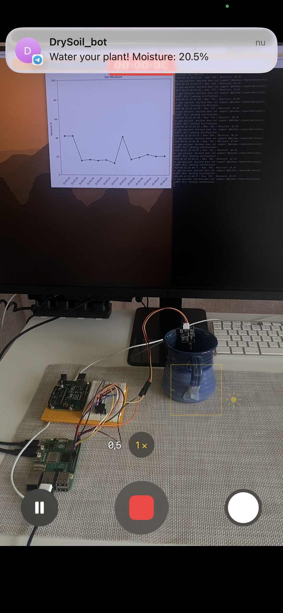


### Why Raspberry Pi over Arduino?

The Raspberry Pi was chosen over Arduino for this project because of its built-in Wi-Fi and Linux OS. This makes it straightforward to send real-time mobile notifications using Python libraries and web services — something an Arduino Uno would need extra hardware shields to do. The tradeoff is higher power consumption and a ~30–60 second boot time, but for a plant monitor that runs continuously from a wall outlet, this is acceptable.

**Disadvantage worth noting:** The Raspberry Pi has no built-in analog pins, so an external MCP3008 ADC chip is required — unlike Arduino which has built-in ADC. This adds one extra component but is the standard approach for Pi-based sensor projects! 


### Signal Flow (for Conceptual Understanding)

The soil moisture sensor generates an analog voltage based on the water content in the soil. Since the Raspberry Pi only understands digital signals, the MCP3008 ADC chip acts as a translator — converting the voltage into a digital number (0–1023) that the Python script can process, log, graph, and act on.


### Common errors I got during build


#### ADC value always high no matter where the sensor is placed
If the raw ADC value stays high even in wet soil or water, the moisture percentage will always appear low or dry.

**Cause:** The AOUT pin on the sensor was not connected correctly.  
**Fix:** Make sure the sensor's AOUT pin is wired into **CH0 (Pin 1)** on the MCP3008.


#### Telegram notification not sending
**Fix:** Test your token before running the full script by pasting this one-liner directly into the terminal

``` python3 -c "import requests; print(requests.post('https://api.telegram.org/bot<YOUR_TOKEN>/sendMessage', json={'chat_id': '<YOUR_CHAT_ID>', 'text': 'hello'}).json())" ``` 

A successful response looks like:
``` {'ok': True, 'result': {'message_id': 2, 'from': ...}} ```

A failed response (invalid token) looks like:
``` {'ok': False, 'error_code': 401, 'description': 'Unauthorized'} ```

---

