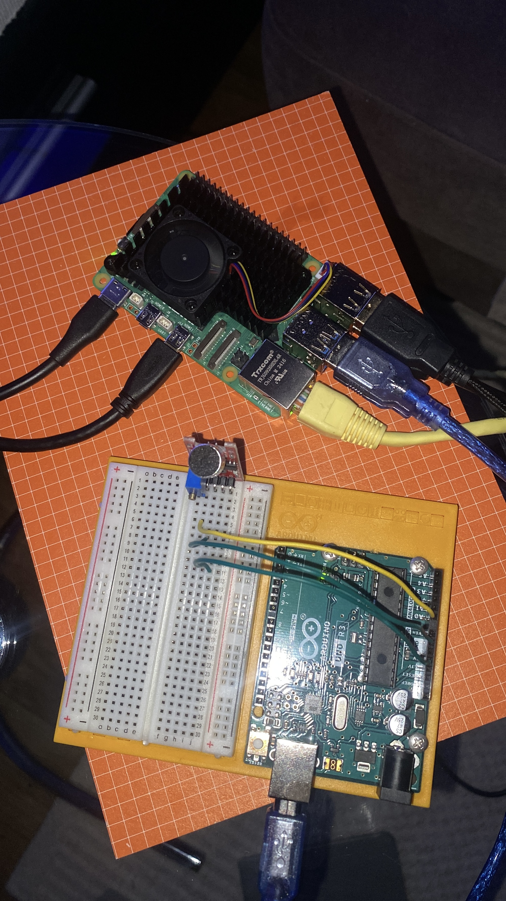

# Environment Data Logger
**Microprocessors & Signals Project**
`Arduino Uno` · `KY-038 Sound Sensor` · `Raspberry Pi` · `Logisim`

---

## What It Does

The KY-038 sound sensor captures ambient sound as an analog voltage. The Arduino Uno samples it, converts it to a number (0–1023) via its built-in ADC (analog-to-digital converter), and streams the values over USB serial to a Raspberry Pi. The Pi logs every reading to a CSV file and plots them as a live graph. 

```
Sound → KY-038 → Arduino (ADC + Serial) → Raspberry Pi → Graph & Log
```

---

## Course Coverage

| Learning Goal | How It's Addressed |
|---|---|
| Analog & digital signals, sampling, quantization | Sensor outputs analog voltage → Arduino samples at fixed intervals → ADC quantizes to 0–1023 |
| Sensors | KY-038 sound sensor as input |
| Microprocessor architecture & programming | Arduino Uno (ATmega328P) in C++; Raspberry Pi (ARM) runs Python |
| Operating systems for microprocessors | Raspberry Pi runs Raspberry Pi OS — Linux on microprocessor-class hardware |
| Digital circuit design | ADC circuit designed and simulated in Logisim before wiring |
| Development project | Full working system from sensor to live display, end to end |

---

## Hardware
- Arduino Uno
- KY-038 sound sensor (analog output)
- LED + resistor — optional visual indicator
- Raspberry Pi with Raspberry Pi OS
- Breadboard, jumper wires, USB cable

## Software
- Arduino IDE — uploads C++ sketch to Arduino
- Logisim Evolution — simulates ADC circuit
- Python 3 on Raspberry Pi — `pip install pyserial matplotlib`

---

## Build Status

| Part | Task | Tool | Status |
|---|---|---|---|
| 1 | Simulate ADC circuit | Logisim | ✓ |
| 2 | Wire KY-038 to read analog values | Arduino | ✓ |
| 3 | Send data over USB serial | Arduino | ✓  |
| 4 | Set up Pi OS to receive data in Python | Raspberry Pi | ✓  |
| 5 | Log data to CSV | Pi + Python |  ✓ |
| 6 | Live graph with matplotlib | Pi + Python | ✓ |
| 7 | Polish, test end to end | All | ✓ |

---

## Notes

### Simulate ADC circuit (Logism)
The 3 pins on the left placed vertically represents dirrerent voltage threshholds: "V1 = low sound", "V2 = medium sound", "V3 = loud sound" 

The next row of three pins represents Binary numbers use only 0s and 1s: B2 = heavy bit (adds 4), B1 = middle bit (adds 2), B0 = light bit (adds 1). Together they output a number 0–7. 
7 = loud, 0 = silent. Changed type to "output" on Logism.

AND gate 1: output is 1 only when BOTH V1 AND V2 are active
→ means sound is at least medium loud
→ result goes to B2 (adds 4 to the number)

AND gate 2: output is 1 only when BOTH V2 AND V3 are active
→ means sound is loud
→ result goes to B1 (adds 2 to the number)

B0: no gate needed — V3 connects directly
→ output is 1 whenever any loud sound is detected
→ adds 1 to the number

## How to Build
> ⚠️ Instructions added as each phase is completed.

### Part 1 - Simulate ADC circuit:
adc_simulation.circ is my Logism sketch to simulate the wiring of a 3-bit ADC circuit (analog-to-digital converter). It correctly converts 3 voltage levels into a binary number 0–7. This is the exact concept inside 
> Arduino's chip. When .circ is placed in VS code it converts to XML language .

## Logisim ADC Circuit


### Part 2 - Wire KY-038:
I use: Arduino Uno, KY-038 sound sensor, Breadboard, 3 jumper wires, USB cable. 

The KYC-038 has 4 pins: 
"+"  →  power (3.3V or 5V)
G  →  ground (negative)
DO   →  digital output
AO   →  analog output ← this is the one I will use

Wiring to the Arduino:
Push the KY-038 into your breadboard, so everything you plug into column 1 (a1, b1, c1, d1, e1) is electrically connected to each other:
AO pin → hole a1 → Arduino A0 with a jumper wire
G pin → hole a2 → Arduino GND with a jumper wire
+ pin → hole a3 → Arduino 5V with a jumper wire
DO pin → hole a4

### Part 3 - Send data over USB serial:
Plug Arduino into Mac via USB, in Arduino IDE after selecting the board "Arduino Uno - /dev/cu.usbmodem1401" Then click "upload" for the C++ code to run:

```
void setup() {
  Serial.begin(9600); // start serial communication at 9600 baud (speed of data transfer)
}

void loop() {
  int soundValue = analogRead(A0); // read sensor value (0-1023)
  Serial.println(soundValue);      // send value to PC
  delay(100);                      // wait 100ms before next reading
}
```
Or download the file I created here :) [`sound_sensor_monitr.ino`](sound_sensor_monitr.ino) — 

Now I can see: KY-038 sensor is very sensitive and picks up tiny vibrations and electrical noise (random interference in the circuit) even in silence. The Arduino's ADC (analog-to-digital converter) is doing exactly what my Logisim circuit simulated eg. converting real sound waves into numbers 0–1023, with Data streams over USB serial to my Mac.

### Part 4 - Set up Pi OS to receive data in Python:
The Micro SD card is what holds the OS.
Connect:
PI to power
PI to monitor (through HDMI)
PI to Mac Mini (through Ethernet)

Install the imager "balena Etcher" (I had trouble with the Raspberry Pi Imager, but both are flasher tools)
- insert micro SD in adapter
- flash from file 
- select target (make sure to select the correct drive with the size etc)
- press "flash", then it will start bruning the file into the SD card...

When done insert the SD card into the Raspberry pie 
Connect the Raspberry PI with keyboard, mouse, monitor, ethernet and power.
Then connect the Arduino to the Raskberry PI: USB A port for Arduino - USB B port (square) cable for PI
Both should light up green at least.

Now when you see the GUI open up the terminal. From the PI terminal type: ```ls /dev/tty*```
(You’re asking the Pi: “show me all connected communication devices”)
> ```ls``` = list files
> ```/dev``` = folder where devices live (hardware shows up as files)
> ```tty*``` = “show all communication ports”

Look for either /dev/ttyACM0 or /dev/ttyUSB0 = the Arduino

Now we´ll read data from it. In terminal: nano read_serial.py
```python
import serial

ser = serial.Serial('/dev/ttyACM0', 9600)

while True:
    line = ser.readline().decode().strip()
    print(line)
```
Save and run from terminal: python3 read_serial.py
I see Numbers start printing (0–1023)! That means Arduino is sending data, Pi is receiving it, Serial connection works. 



### Part 5 - Log data to CSV
Now lets make/replace the old python script to also log incoming data into a .csv file, allowing persistent storage for later analysis and visualization: read_serial_to_csv.py
```python
import serial
import csv

ser = serial.Serial('/dev/ttyACM0', 9600)

with open('sound_data.csv', 'w', newline='') as f:
    writer = csv.writer(f)
    while True:
        line = ser.readline().decode().strip()
        print(line)
        writer.writerow([line])
```


In terminal run the script: python3 read_serial_to_csv.py
Then stop it: CTRL + C
Then check the new file with data log exists, use ```ls``` to list all files

In terminal Check the content with ```cat sound_data.csv```
Logging works!

[▶ Watch demo video 2](photos/IMG_3682.mov)

### Part 6 - Live graph with matplotlib
Now lets make the data displayed as a live graph: read_serial_to_graph.py
```python
import serial
import matplotlib.pyplot as plt

ser = serial.Serial('/dev/ttyACM0', 9600)
data = []
plt.ion()

while True:
    line = ser.readline().decode().strip()
    if line == "":
        continue
    value = int(line)

    data.append(value)
    data = data[-50:]
    plt.clf()
    plt.plot(data)
    plt.pause(0.01)
```

Before running the script, matplotlib must be installed using apt (the Linux system package manager) rather than pip. This is because on Raspberry Pi OS, matplotlib depends on system-level graphics libraries that pip alone cannot install. Using apt ensures both matplotlib and all its dependencies are installed correctly: ```sudo apt install python3-matplotlib```

In terminal run the script: python3 read_serial_to_graph.py
A window pops up and my Graph moves in real-time!

[▶ Watch demo video](photos/IMG_3680.mov)

### Part 7 - Polish, test end to end
:)
