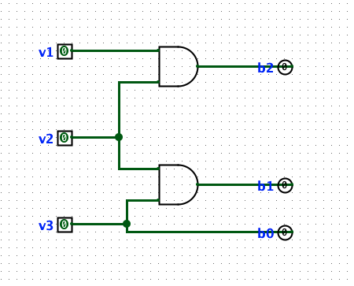

# Environment Data Logger
**Microprocessors & Signals Project**
`Arduino Uno` · `KY-038 Sound Sensor` · `Raspberry Pi` · `Logisim`

---

## What It Does

The KY-038 sound sensor captures ambient sound as an analog voltage. The Arduino Uno samples it, converts it to a number (0–1023) via its built-in ADC (analog-to-digital converter), and streams the values over USB serial to a Raspberry Pi. The Pi logs every reading to a CSV file and plots them as a live graph. A buzzer fires when sound crosses a set threshold.

```
Sound → KY-038 → Arduino (ADC + Serial) → Raspberry Pi → Graph & Log
```

---

## Course Coverage

| Learning Goal | How It's Addressed |
|---|---|
| Analog & digital signals, sampling, quantization | Sensor outputs analog voltage → Arduino samples at fixed intervals → ADC quantizes to 0–1023 |
| Sensors & actuators | KY-038 sound sensor as input, buzzer as output actuator |
| Microprocessor architecture & programming | Arduino Uno (ATmega328P) in C++; Raspberry Pi (ARM) runs Python |
| Operating systems for microprocessors | Raspberry Pi runs Raspberry Pi OS — Linux on microprocessor-class hardware |
| Digital circuit design | ADC circuit designed and simulated in Logisim before wiring |
| Development project | Full working system from sensor to live display, end to end |

---

## Hardware
- Arduino Uno
- KY-038 sound sensor (analog output)
- Buzzer — actuator, reacts to sound threshold
- LED + resistor — optional visual indicator
- Raspberry Pi with Raspberry Pi OS
- Breadboard, jumper wires, USB cable

## Software
- Arduino IDE — uploads C++ sketch to Arduino
- Logisim Evolution — simulates ADC circuit
- Python 3 on Raspberry Pi — `pip install pyserial matplotlib`

---

## Build Status

| Days | Task | Tool | Status |
|---|---|---|---|
| 1–2 | Simulate ADC circuit | Logisim | ✓ |
| 3–4 | Wire KY-038, read analog values | Arduino | ✓ |
| 5–6 | Send data over USB serial | Arduino | ✓  |
| 7–8 | Set up Pi OS, receive data in Python | Raspberry Pi | ⬜ |
| 9–10 | Log data to CSV | Pi + Python | ⬜ |
| 11–12 | Live graph with matplotlib | Pi + Python | ⬜ |
| 13–14 | Add buzzer actuator on threshold | Arduino + Pi | ⬜ |
| 15–18 | Polish, test end to end | All | ⬜ |

---

## Notes

### Simulate ADC circuit (Logism)
The 3 pins on the left placed vertically represents dirrerent voltage threshholds: "V1 = low sound", "V2 = medium sound", "V3 = loud sound" 

The next row of three pins represents Binary numbers use only 0s and 1s: B2 = heavy bit (adds 4), B1 = middle bit (adds 2), B0 = light bit (adds 1). Together they output a number 0–7. 
7 = loud, 0 = silent. Changed type to "output" on Logism.

AND gate 1: output is 1 only when BOTH V1 AND V2 are active
→ means sound is at least medium loud
→ result goes to B2 (adds 4 to the number)

AND gate 2: output is 1 only when BOTH V2 AND V3 are active
→ means sound is loud
→ result goes to B1 (adds 2 to the number)

B0: no gate needed — V3 connects directly
→ output is 1 whenever any loud sound is detected
→ adds 1 to the number

## How to Run
> ⚠️ Instructions added as each phase is completed.

### Day 1:
 adc_simulation.circ is my Logism sketch to simulate the wiring of a 3-bit ADC circuit (analog-to-digital converter). It correctly converts 3 voltage levels into a binary number 0–7. This is the exact concept inside  Arduino's chip. When .circ is placed in VS code it converts to XML language .

## Logisim ADC Circuit


### Day 2:
I use: Arduino Uno, KY-038 sound sensor, Breadboard, 3 jumper wires, USB cable. 

The KYC-038 has 4 pins: 
"+"  →  power (3.3V or 5V)
G  →  ground (negative)
DO   →  digital output
AO   →  analog output ← this is the one I will use

Wiring to the Arduino:
Push the KY-038 into your breadboard, so everything you plug into column 1 (a1, b1, c1, d1, e1) is electrically connected to each other:
AO pin → hole a1 → Arduino A0 with a jumper wire
G pin → hole a2 → Arduino GND with a jumper wire
+ pin → hole a3 → Arduino 5V with a jumper wire
DO pin → hole a4

Plug  Arduino into Mac via USB, in Arduino IDE after selecting the board "Arduino Uno - /dev/cu.usbmodem1401" Then click "upload" for the C++ code to run:

[`sound_sensor_monitr.ino`](sound_sensor_monitr.ino) — 

Now I can see: KY-038 sensor is very sensitive and picks up tiny vibrations and electrical noise (random interference in the circuit) even in silence. The Arduino's ADC (analog-to-digital converter) is doing exactly what my Logisim circuit simulated eg. converting real sound waves into numbers 0–1023, with Data streams over USB serial to my Mac.

### Day 3:
The Micro SD card is what holds the OS.
Connect:
PI to power
PI to monitor (through HDMI)
PI to Mac Mini (through Ethernet)

In terminal run arp -a. This shows all devices connected to Mac.

Remove the SD card and plug into Mac. Now the SD card mounted on your Mac! The bootfs drive is exactly what we need.

Open Terminal: touch /Volumes/bootfs/ssh (This creates an empty file called ssh in the boot partition — Raspberry Pi OS sees this file on startup and automatically enables SSH)
Then: ls /Volumes/bootfs/ (lists all files)
Then: cat /Volumes/bootfs/issue.txt (get current PI OS version)

New Raspberry Pi OS requires you to set a username and password during first boot using a special file. There is no default pi user anymore:

In terminal: 
openssl passwd -1 hejhej  (It will output a long string. Copy that entire string)
echo 'admin:PASTE_THE_STRING_HERE' > /Volumes/bootfs/userconf.txt (creates the user file named userconf.txt)

Then eject the SD card, put it back in the Pi, boot it up:
ssh admin@192.168.1.103

*Built for Microprocessors & Signals*
